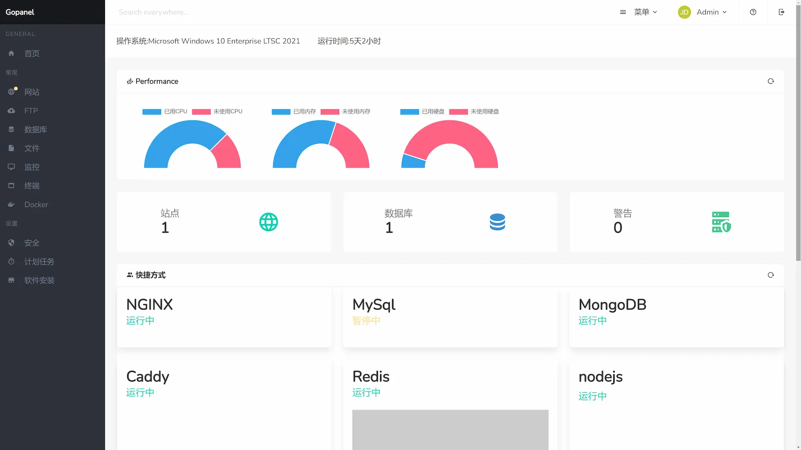
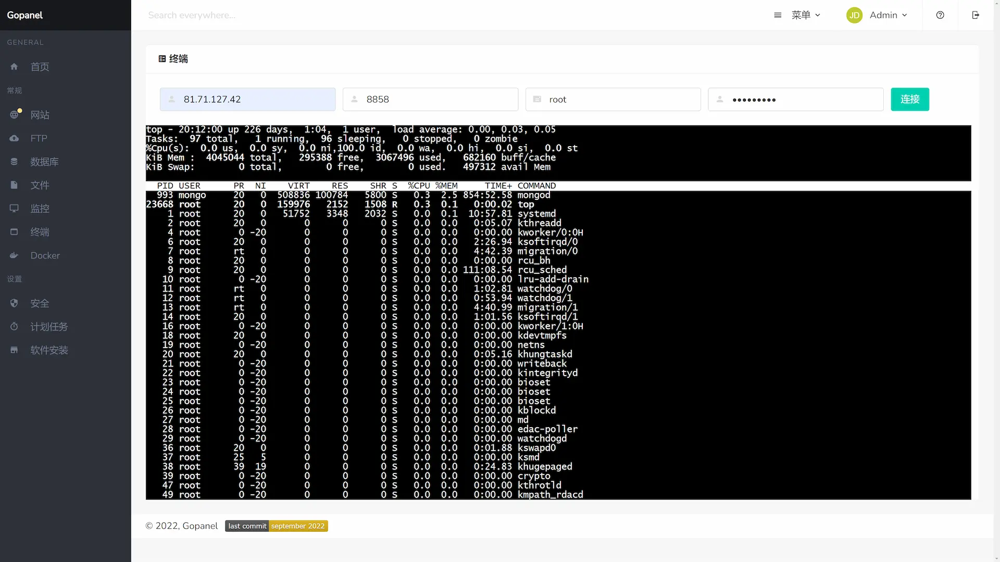

<p></p>


---

## ABOUT

**Gopanel** It is a management panel written in Go language with zero dependencies, super simple deployment and very simple functions.

❗Entertainment project, do not use in production environment

#### INSTALL
```shell
# For other platforms, please replace wget link your ARCH and OS 
wget https://github.com/BapiGso/gopanel/releases/latest/download/gopanel_linux_amd64 -O /usr/local/bin/gopanel
chmod +x /usr/local/bin/gopanel
cat <<EOF > /etc/systemd/system/gopanel.service
[Unit]
Description=GoPanel Service
After=network.target

[Service]
Type=simple
User=root
ExecStart=/usr/local/bin/gopanel
Restart=on-failure

[Install]
WantedBy=multi-user.target
EOF

systemctl daemon-reload
systemctl enable gopanel
systemctl start gopanel
systemctl status gopanel
```

#### FUNCTION
 - Panel security entrance
 - Server monitoring
 - webssh
 - webdav server
 - web file editor
 - caddy manage


#### TODOLIST
 - cron
 - docker manage

## LICENSE

released under the [BSD License](https://github.com/webmin/webmin/blob/master/LICENCE).
