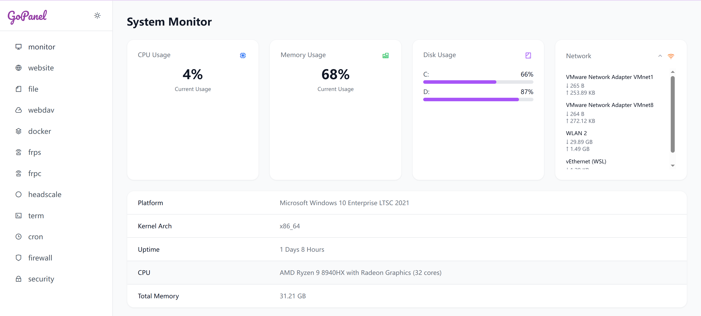

# gopanel



A lightweight Go-based management panel with simple deployment and practical built-in tools.


> Entertainment project. Do not use in production.

## Quick Start

<details open>
<summary><strong>Install</strong></summary>

```bash
bash <(curl -s https://raw.githubusercontent.com/BapiGso/gopanel/master/shell/install_gopanel.sh)
```

Or download the appropriate version for your platform from the [Releases](https://github.com/BapiGso/gopanel/releases) page and run it directly.

</details>

<details>
<summary><strong>Uninstall</strong></summary>

```bash
bash <(curl -s https://raw.githubusercontent.com/BapiGso/gopanel/master/shell/uninstall_gopanel.sh)
```

</details>

## Features

| Module               | Description                          | Dependency                                                     |
| -------------------- | ------------------------------------ | -------------------------------------------------------------- |
| Security Entrance    | Panel security entry and protection  | Built-in                                                       |
| Server Monitor       | Basic server monitoring              | [shirou/gopsutil](https://github.com/shirou/gopsutil)          |
| Cron                 | Scheduled task management            | [go-co-op/gocron](https://github.com/go-co-op/gocron)          |
| WebSSH               | Terminal access in the browser       | [golang.org/x/crypto/ssh](https://pkg.go.dev/golang.org/x/crypto/ssh) |
| WebDAV               | WebDAV server support                | [golang.org/x/net/webdav](https://pkg.go.dev/golang.org/x/net/webdav) |
| File Editor          | Web file manager and editor          | Built-in                                                       |
| Caddy Manage         | Caddy service management             | [caddyserver/caddy](https://github.com/caddyserver/caddy)      |
| FRPS Manage          | frps management                      | [fatedier/frp](https://github.com/fatedier/frp)                |
| FRPC Manage          | frpc management                      | [fatedier/frp](https://github.com/fatedier/frp)                |
| Docker Manage        | Docker management                    | [docker/docker](https://github.com/docker/docker)              |
| Firewall             | Firewall management                  | [google/nftables](https://github.com/google/nftables)          |
| UnblockNeteaseMusic  | Currently disabled                   | [cnsilvan/UnblockNeteaseMusic](https://github.com/cnsilvan/UnblockNeteaseMusic) |

## Roadmap

<details>
<summary><strong>Planned / TODO</strong></summary>

- headscale ([juanfont/headscale](https://github.com/juanfont/headscale))

</details>

## Project Links

- [Releases](https://github.com/BapiGso/gopanel/releases)
- [Issues](https://github.com/BapiGso/gopanel/issues)
- [License](https://github.com/BapiGso/gopanel/blob/master/LICENSE)

## License

Released under the [Apache License](https://github.com/BapiGso/gopanel/blob/master/LICENSE).

## Acknowledgments

Thanks to the Go community and all open-source contributors who made this project possible.
